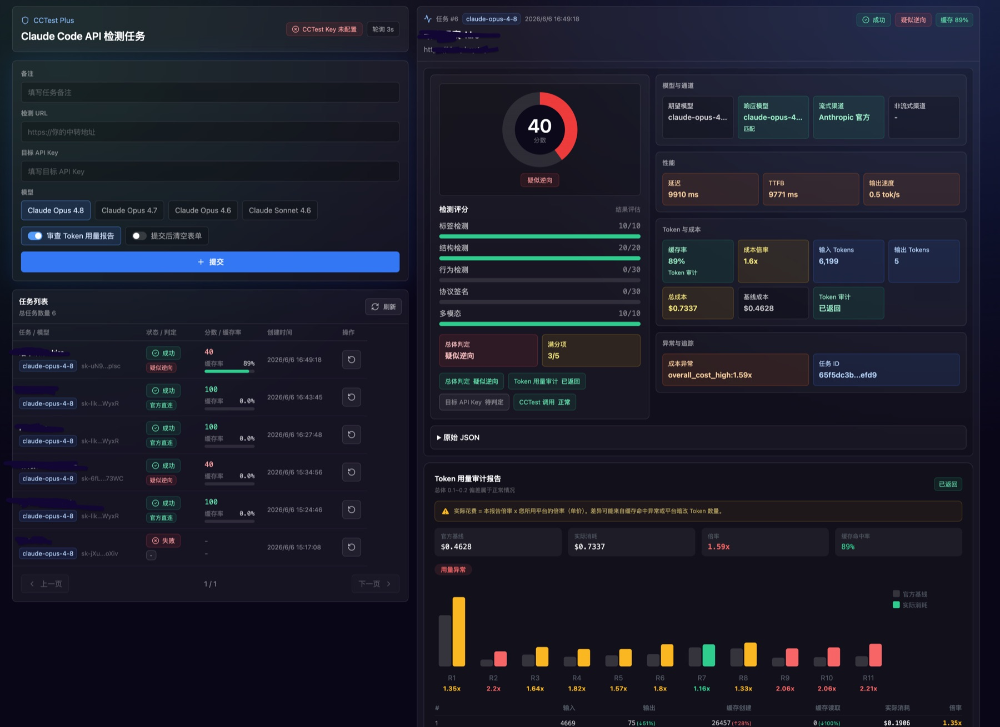
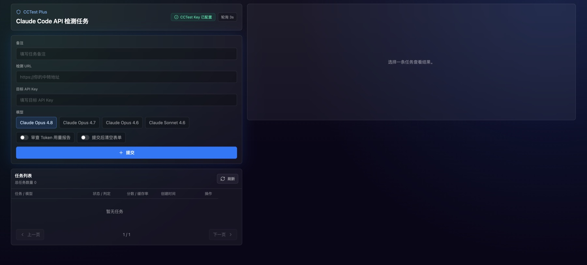

# cctest-plus

cctest-plus 是一个 CCTest 批量检测任务 GUI, 没有魔法和科技, 需要您购买检测次数才能用!

这个项目没有登录、认证和权限控制。它适合在本机或可信内网使用，不建议直接暴露到公网。目标 API Key 会写入本地 SQLite 数据库，页面展示时会脱敏。

本项目由 AI 根据需求生成，使用前建议自行审查代码、配置和运行环境。

使用本项目必须购买 [cctest](https://cctest.ai) 检测次数包, 拿到对应API Key 才可以使用 [cctest传送门](https://cctest.ai)

## 界面预览

任务结果与 Token 用量审计：



初始任务列表：



## 功能

- 提交 CCTest 检测任务，并为每个任务填写备注作为任务名。
- 支持一次选择多个模型，前端会按模型循环创建任务。
- 任务只允许新增，不提供删除能力。
- 后端每 3 秒轮询 CCTest 结果，最长等待 30 分钟。
- Web 端每 3 秒轮询本地后端，任务进入最终状态后停止轮询。
- 任务列表按创建时间倒序分页。
- 结果页参考 CCTest 官方样式，包含评分、判定、检测指标、Token 用量审计和缓存命中展示。
- 支持“再来一次”，可基于原任务重新创建检测。

## 支持模型

当前内置模型：

```text
claude-opus-4-8
claude-opus-4-7
claude-opus-4-6
claude-sonnet-4-6
```

## 配置

复制示例环境变量文件：

```bash
cp .env.example .env
```

然后编辑 `.env`，至少配置：

```bash
CCTEST_API_KEY=cct-YOUR_KEY
```

后端会自动尝试读取 `.env`。如果 `.env` 不存在，不会报错。

配置优先级：

```text
.env > 命令行参数 > 系统环境变量
```

常用配置：

```text
CCTEST_API_KEY        CCTest 平台 API Key
CCTEST_BASE_URL       CCTest 地址，默认 https://cctest.ai
APP_PORT              后端端口，默认 8080
DATABASE_PATH         SQLite 路径，默认 ./data/cctest-plus.sqlite
POLL_INTERVAL_SECONDS 后端轮询间隔，默认 3
TASK_TIMEOUT_MINUTES  单任务最长等待时间，默认 30
DEV_CORS_ORIGIN       开发环境前端地址，默认 http://localhost:5173
```

## Docker 启动

建议挂载 `data` 目录，避免容器重启或重建后丢失 SQLite 数据。

使用 GitHub Container Registry 镜像：

```bash
mkdir -p data

docker run -d \
  --name cctest-plus \
  --restart unless-stopped \
  -e CCTEST_API_KEY=cct-YOUR_KEY \
  -p 8080:8080 \
  -v "$PWD/data:/app/data" \
  ghcr.io/thefern97941/cctest-plus:latest
```

访问：

```text
http://localhost:8080
```

停止：

```bash
docker stop cctest-plus
docker rm cctest-plus
```

也可以在源码目录使用 Docker Compose：

```bash
mkdir -p data
cp .env.example .env
# 编辑 .env，填入 CCTEST_API_KEY

docker compose up --build -d
docker compose logs -f
```

停止：

```bash
docker compose down
```

## 源码启动

准备配置：

```bash
cp .env.example .env
# 编辑 .env，填入 CCTEST_API_KEY
mkdir -p data
```

启动后端：

```bash
cd backend
go test ./...
go run ./cmd/server
```

另开一个终端启动前端：

```bash
cd frontend
npm install
npm run dev
```

开发环境访问：

```text
http://localhost:5173
```

前端开发服务器会把 `/api` 请求代理到本地后端。

## GitHub 镜像打包

仓库地址：

[TheFern97941/cctest-plus](https://github.com/TheFern97941/cctest-plus)

项目包含 GitHub Actions 工作流，会在推送到 `main` 分支时构建 Docker 镜像并推送到 GitHub Container Registry：

```text
ghcr.io/thefern97941/cctest-plus:latest
ghcr.io/thefern97941/cctest-plus:sha-<commit>
```

也可以在 GitHub Actions 页面手动触发打包。

## 安全说明

- 不要提交 `.env`。
- 不要提交 `data/*.sqlite` 或 SQLite WAL/SHM 文件。
- `CCTEST_API_KEY` 只应放在本地 `.env`、系统环境变量或部署环境 Secret 中。
- 目标 API Key 会存入 SQLite，因为本项目定位是本地或内网工具。
- 对外提供服务前，请自行增加认证、访问控制和网络隔离。

## 后端 API

```text
GET /api/health
GET /api/models
POST /api/tasks
GET /api/tasks?page=1&page_size=20
GET /api/tasks/:id
POST /api/tasks/:id/rerun
```

`POST /api/tasks` 示例：

```json
{
  "remark": "晚高峰检测",
  "url": "https://your-relay.com",
  "apiKey": "sk-your-upstream-key",
  "model": "claude-opus-4-8",
  "checkTokenUsage": false
}
```

## 技术栈

- 后端：Go + Gin
- 数据库：SQLite
- 前端：React + Tailwind CSS
- 图表与可视化：SVG / CSS
